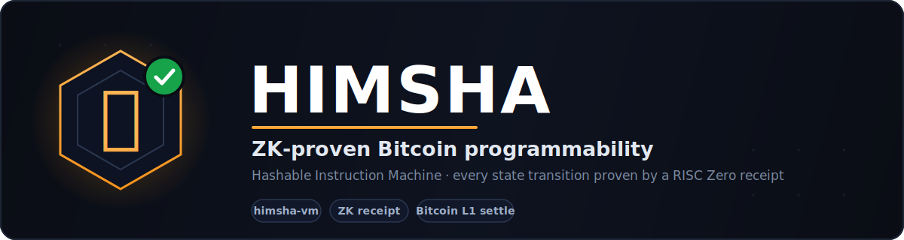

<p align="center">
  
</p>

<p align="center">
  <a href="#implementation-status"></a>
  
  <a href="./LICENSE"></a>
  
</p>

<p align="center">
  
  
  
  
  
  
  
  
</p>

# HIMSHA Network

> **DISCLAIMER: This project is for educational purposes only. It is NOT production-grade software. Do not use it with real Bitcoin mainnet funds. The ZK proofs, consensus mechanisms, and Bitcoin integration are proof-of-concept implementations that have not been audited or tested for production use.**

HIMSHA (Hashable Instruction Machine) is an experimental Bitcoin programmability layer. Every state transition is proven correct by a RISC Zero ZK receipt — not validator majority vote.

---

## Architecture

```
User → himsha-node (JSON-RPC :9100)
           ↓ RuntimeTransaction
       himsha-vm (RISC Zero zkVM)
           ↓ ZK receipt + new account state
       himsha-runtime (account model, UTXO anchoring)
           ↓ commit state to Bitcoin UTXO
       Bitcoin L1 (final settlement)
```

Unlike consensus-only systems, HIMSHA uses ZK proofs to guarantee program correctness independently of validator honesty.

---

## Implementation Status

A snapshot of the core security model. **Done** = implemented and enforced, covered by
the Rust test suite (182 tests, `cargo test --workspace`). **Under testing / partial** =
the mechanism exists but isn't fully hardened, or needs an external system (the RISC Zero
toolchain or a Bitcoin regtest node) to exercise end-to-end.

### ✅ Done (enforced + unit-tested)

| Area | What's enforced |
|------|-----------------|
| **Transaction signatures** | BIP-340 Schnorr (secp256k1); the node rejects unsigned, forged, or tampered transactions at ingestion. |
| **Replay protection** | Signed `recent_blockhash` + `chain_id`, recent-window expiry, and txid de-duplication. |
| **Writable enforcement** | `write_data` refuses to mutate an account an instruction declared read-only. |
| **Owner enforcement** | Every write is owner-gated post-execution: a program may only change accounts it owns (plus lamport credits and first-writer claims on blank accounts). Enforced CPI-aware at every invocation boundary, in native dispatch, the zkVM guest, and on deployed-program output. |
| **CPI depth limit** | Nested cross-program calls bounded (`MAX_CPI_DEPTH = 4`) — no stack-blow DoS. |
| **Atomic state** | A transaction's account writes commit in a single DB transaction (all-or-nothing). |
| **Execution timing** | Execution happens at **block production**, not RPC time: `himsha_sendTransaction` validates + preflights (synchronous errors) + queues; the block producer executes each queued tx authoritatively in one deterministic order, including only those that commit. Outcomes are polled via `himsha_getSignatureStatus` (`pending`/`succeeded`/`failed{reason}`). |
| **ZK receipt binding** | The node persists a state transition only if its receipt commits to exactly the accounts produced (native integrity gate); the zkVM path additionally rejects a guest that returns a different account table than it was given. |
| **Programs** | system, token, ATA, swap (AMM), lending, money-market (interest-bearing cToken lender shares, kinked rate model, close-factor-bounded liquidation, staleness-gated oracle price), yield vault (lends idle assets via CPI, deposits **and** withdrawals priced off live on-chain NAV, auto-undeploy on withdraw), NFT metadata, runes, oracle (multi-publisher median + per-step deviation bound). |

### 🧪 Under testing / partial

| Area | Status |
|------|--------|
| **ZK proving (soundness)** | Native execution is integrity-checked but not cryptographically proven. The verified-receipt path needs the RISC Zero toolchain (`--features zkvm`); `proof_bytes` currently holds the journal, not a re-verifiable STARK seal. |
| **Compute metering** | CPI depth *and* fan-out width are bounded (per-instruction compute budget charged at every invocation). Arbitrary in-program loops *inside* a single program are still bounded only on the zkVM path (cycle limit), not native dispatch. |
| **Bitcoin L1 anchoring** | Each block carries a Merkle `state_root` over the account table (bound into the blockhash); the producer commits it to Bitcoin via OP_RETURN every `HIMSHA_ANCHOR_INTERVAL` blocks, and `himsha_getStateProof` serves inclusion proofs (verifiable client-side — see the TS SDK `verifyAccountInState`). Followers recompute the root after replication and flag divergence. End-to-end OP_RETURN broadcast needs a funded regtest wallet to verify. |
| **Consensus replication** | Raft *election* safety only — no log replication / commit index; followers re-derive by polling the leader. |
| **Threshold custody** | FROST/Taproot committee is now *wired into settlement*: set `HIMSHA_THRESHOLD="M/N"` and inscription settlements are threshold-signed via a Taproot key-spend (else single hot wallet). The in-process committee co-locates all shares (educational, not real custody decentralization) and end-to-end Bitcoin acceptance is still unverified without a regtest node funding the committee address (`himsha_getCustodyInfo`). |
| **Lightning** | Requires an external LND node; unverified without one. |

> See [`CONTRIBUTING.md`](./CONTRIBUTING.md) and the root disclaimer — this is an
> educational proof of concept, not audited or production-ready.

---

## Programs

| Package | Description |
|---------|-------------|
| `himsha-programs/system` | Account creation, lamport transfer, ownership |
| `himsha-programs/token` | Fungible token (mint, transfer, burn, freeze) |
| `himsha-programs/ata` | Deterministic per-user token accounts |
| `himsha-programs/swap` | Constant-product AMM (x·y=k) |
| `himsha-programs/lending` | Bitcoin Ordinals collateral lending |
| `himsha-programs/nft-metadata` | On-chain NFT name, symbol, URI, royalties |
| `himsha-programs/runes` | Bitcoin Runes fungible tokens (etch, open-mint, transfer, burn) |
| `himsha-programs/money-market` | Over-collateralized borrowing (supply, borrow, repay, interest accrual, liquidation) |
| `himsha-programs/vault` | Automated yield vault (ERC-4626-style shares, keeper-reported NAV, performance fees) |

---

## Quick Start

### Prerequisites

- Rust 1.87+ (workspace MSRV, gated in CI)
- Bitcoin Core (regtest for local dev)
- RISC Zero toolchain: `cargo install cargo-risczero && cargo risczero install`

### Build

```bash
cargo build --workspace
```

### Run a local node

```bash
HIMSHA_DB=./him.redb cargo run -p himsha-node
# Node listens on http://127.0.0.1:9100
```

### CLI

```bash
# Check node status
himsha node status

# Deploy a program
himsha deploy --elf ./target/deploy/my_program.so --image-id <hex>

# Query an account
himsha account get <pubkey>

# Get current slot
himsha node slot
```

### JSON-RPC

All methods use `http://localhost:9100` with `Content-Type: application/json`:

```bash
# Check readiness
curl -X POST http://localhost:9100 \
  -H "Content-Type: application/json" \
  -d '{"jsonrpc":"2.0","id":1,"method":"himsha_isNodeReady","params":[]}'

# Get slot
curl -X POST http://localhost:9100 \
  -H "Content-Type: application/json" \
  -d '{"jsonrpc":"2.0","id":1,"method":"himsha_getSlot","params":[]}'
```

---

## RPC Reference

| Method | Params | Returns |
|--------|--------|---------|
| `himsha_sendTransaction` | `RuntimeTransaction` | tx id (hex) |
| `himsha_getAccountInfo` | `pubkey: String` | `AccountInfo \| null` |
| `himsha_getProgramAccounts` | `program_id: String` | `AccountInfo[]` |
| `himsha_deployProgram` | `elf_hex, image_id_hex` | program pubkey |
| `himsha_getBlock` | `slot: u64` | `Block \| null` |
| `himsha_getSlot` | — | `u64` |
| `himsha_isNodeReady` | — | `bool` |
| `himsha_listPrograms` | — | `String[]` |
| `himsha_getUtxo` | `txid, vout` | `UtxoInfo \| null` |
| `himsha_requestAirdrop` | `pubkey, lamports` | new balance (dev faucet; `HIMSHA_FAUCET=1`) |
| `himsha_getMultipleAccounts` | `pubkeys[]` | `(AccountInfo \| null)[]` |
| `himsha_getProcessedTransaction` | `txid` | `RuntimeTransaction \| null` |
| `himsha_getVersion` | — | `String` |
| `himsha_getPeers` | — | `String[]` |
| `himsha_createAccountWithFaucet` | `pubkey, lamports, space` | `AccountInfo` (dev faucet) |
| `himsha_sendTransactions` | `RuntimeTransaction[]` | tx ids `String[]` |
| `himsha_recentTransactions` | `limit` | `RuntimeTransaction[]` |
| `himsha_getAccountAddress` | `pubkey` | Bitcoin P2TR address |
| `himsha_getBlockHash` | `slot` | hash hex \| null |
| `himsha_getBestBlockHash` | — | hash hex \| null |
| `himsha_getNetworkPubkey` | — | `String` |
| `himsha_preVote` | `term, candidate` | `VoteReply` (Raft PreVote; non-binding) |
| `himsha_requestVote` | `term, candidate` | `VoteReply` (Raft election) |
| `himsha_getLeader` | — | `LeaderInfo` (heartbeat / re-point) |
| `himsha_createInvoice` | `amount_sat, memo` | BOLT-11 string ⚡ |
| `himsha_payInvoice` | `bolt11` | payment hash ⚡ |
| `himsha_lightningBalance` | — | channel balance (sats) ⚡ |
| `himsha_getAllAccounts` | `limit` | `AccountInfo[]` (0 = all) |
| `himsha_getTxidFromBtcTxid` | `btc_txid` | HIMSHA txid \| null (settlement lookup) |
| `himsha_getStats` | — | `{accounts, transactions, tip_slot, programs}` (indexed) |
| `himsha_getCustodyInfo` | — | `{threshold, total, group_key, address} \| null` (FROST settlement custody; `HIMSHA_THRESHOLD="M/N"`) |
| `himsha_getStateProof` | `pubkey: String` | `{state_root, leaf, index, siblings[], anchored_*} \| null` (Merkle inclusion proof vs. the Bitcoin-anchored state root) |
| `himsha_getSignatureStatus` | `txid: String` | `{status, slot?, error?} \| null` (`pending`/`succeeded`/`failed` — execution outcome) |

⚡ Lightning methods require an LND node configured via `LND_REST_URL` +
`LND_MACAROON_HEX`; otherwise they return error `-32040` (*lightning not
configured*). See [docs/lightning.md](docs/lightning.md).

---

## Repository Layout

```
bitcoin-tect/
├── himsha-runtime/        Core types (accounts, transactions, UTXO, ZK receipt)
├── himsha-vm/             RISC Zero zkVM executor + program registry
├── himsha-node/           JSON-RPC node, Bitcoin indexer, block producer
├── himsha-programs/
│   ├── system/         System program
│   ├── token/          Token program
│   ├── ata/            Associated Token Account program
│   ├── swap/           AMM swap program
│   ├── lending/        Ordinals lending program
│   ├── nft-metadata/   NFT metadata program
│   ├── runes/          Bitcoin Runes program
│   └── money-market/   Over-collateralized borrowing
├── himsha-cli/            Command-line tool
└── docs/               Infrastructure setup guides
```

---

## Program execution (native vs. zkVM)

Each built-in program is a plain Rust crate exposing `process()`. There are two execution paths:

- **Native dispatch** (default today) — the node runs built-in programs directly via
  [`himsha-vm::dispatch`](himsha-vm/src/dispatch.rs). Execution is deterministic and produces the
  same state transition the guest would, but **skips proof generation** (the receipt is marked
  `verified: false`). This lets the node run end-to-end without the RISC Zero toolchain.
- **zkVM proving** — deployed (non-built-in) programs, and built-ins once compiled to guest ELFs,
  run through `ProgramExecutor::execute` which generates and verifies a RISC Zero receipt.

Enable proving for **all** programs (built-ins via a universal RISC Zero guest) with the opt-in
`zkvm` feature — this requires the RISC Zero toolchain (`cargo-risczero` + `r0vm`):

```bash
cargo run -p himsha-node --features zkvm
```

See [`docs/zkvm-proving.md`](./docs/zkvm-proving.md) for the architecture and caveats, and
[`CONTRIBUTING.md`](./CONTRIBUTING.md) to contribute.

---

## Use Cases

The product suite built on these programs — see [`docs/use-cases/`](./docs/use-cases/README.md):

- [Swap](./docs/use-cases/swap.md) — native BTC trading with atomic settlement
- [Lend](./docs/use-cases/lend.md) — Bitcoin-backed credit with fast liquidation
- [Prime](./docs/use-cases/prime.md) — real-time portfolio management
- [Yield Vaults](./docs/use-cases/yield-vaults.md) — automated yield strategies
- [AI Copilot](./docs/use-cases/ai-copilot.md) — LLM + RAG advisory across all four

Per-module developer docs: [`docs/modules/`](./docs/modules/README.md).

---

## Infrastructure Guides

See [`docs/`](./docs/) for:

- [Testing locally — regtest, testnet, Lightning, failover](./docs/testing-locally.md)
- [Bitcoin Indexer + Ord Setup with Docker](./docs/bitcoin-indexer-docker.md)
- [Bitcoin Indexer + Ord Setup with Kubernetes & Terraform](./docs/bitcoin-indexer-k8s-terraform.md)
- [ZK Proving (RISC Zero guest) — opt-in](./docs/zkvm-proving.md)
- [Lightning Network integration ⚡](./docs/lightning.md)

### Deployment

- [Deployment guides overview](./docs/deployment/README.md)
- [Bare metal](./docs/deployment/bare-metal.md)
- [AWS (EC2 / ECS Fargate)](./docs/deployment/aws.md)
- [Google Cloud (Compute Engine / Cloud Run)](./docs/deployment/gcp.md)
- [Azure (VM / Container Apps)](./docs/deployment/azure.md)

---

## Contributors

Built and maintained by:

<table>
  <tr>
    <td align="center" width="160">
      <a href="https://github.com/himanshu64">
        <br/>
        <sub><b>himanshu64</b></sub>
      </a><br/>
      <sub>Creator &amp; maintainer</sub>
    </td>
  </tr>
</table>

HIMSHA is **fully open source** — contributions are welcome. Pick a
[good first issue / roadmap item](https://github.com/himanshu64/himsha-network/milestone/1),
read [`CONTRIBUTING.md`](./CONTRIBUTING.md), and open a PR.

<a href="https://github.com/himanshu64/himsha-network/graphs/contributors">
  
</a>

<sub>The avatar grid above updates automatically as new contributors merge PRs.</sub>
